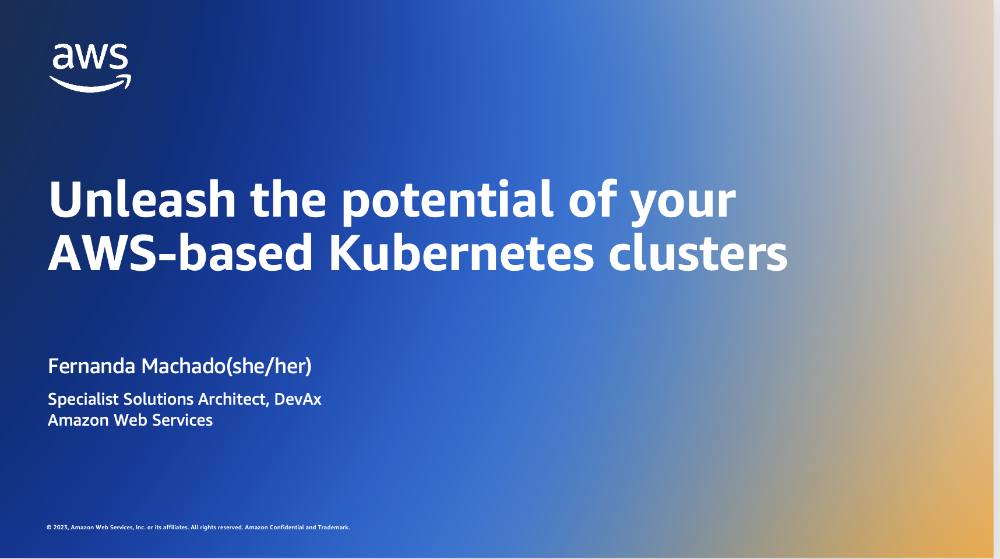

This repository contains the code used for the demonstrations of the following presentation at the [Dutch Cloud Native/Kubernetes 2023] meetup (https://www.meetup.com/dutch-kubernetes-meetup/events/294866183/]).

You can download the slide deck [here](https://s12d.com/jfall2022-slide-deck). 

